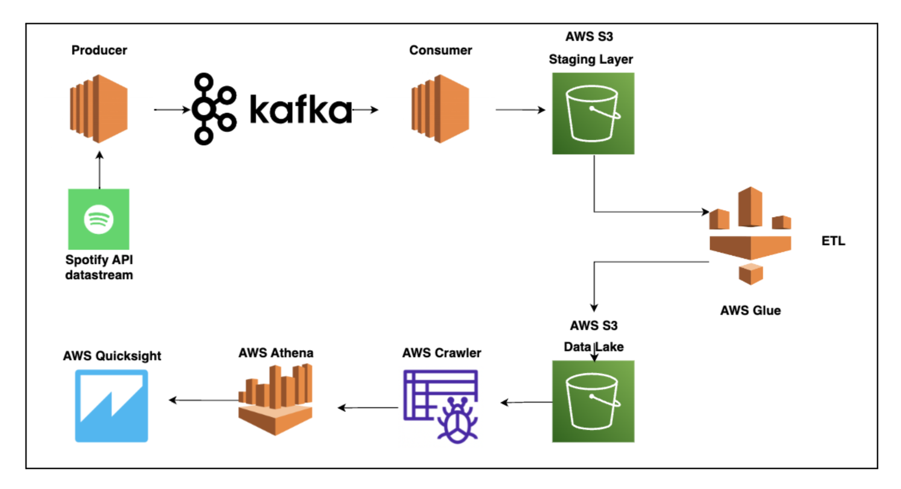
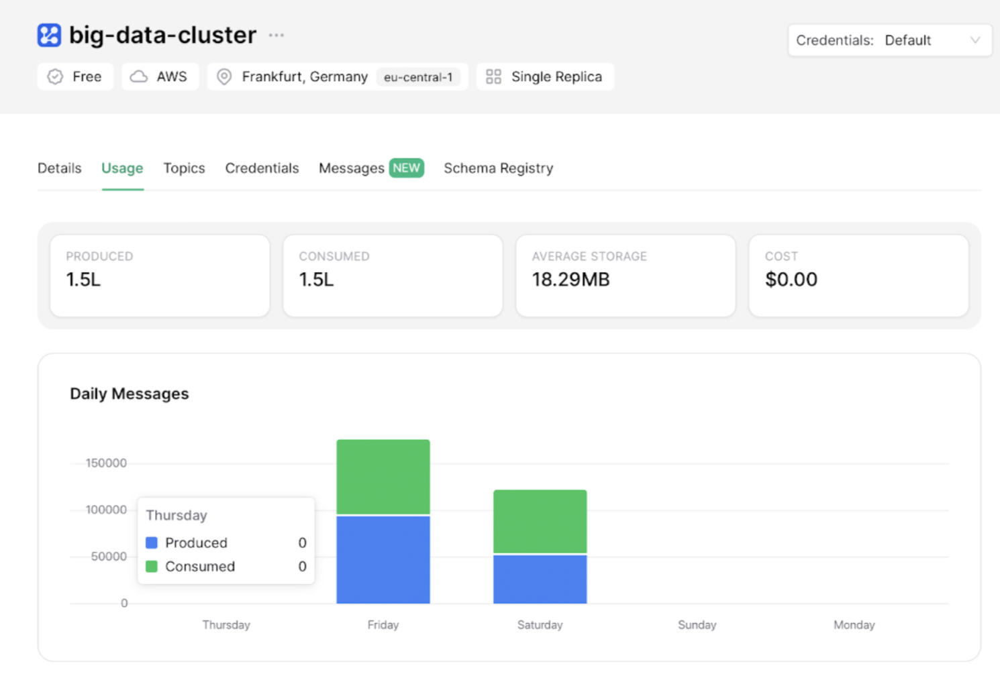
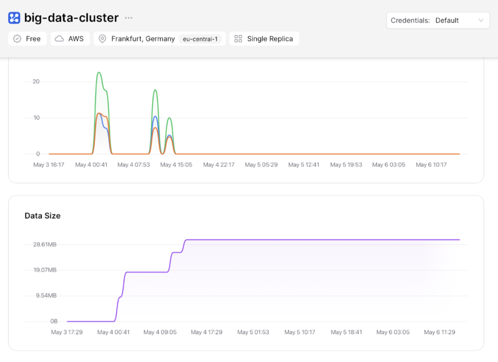
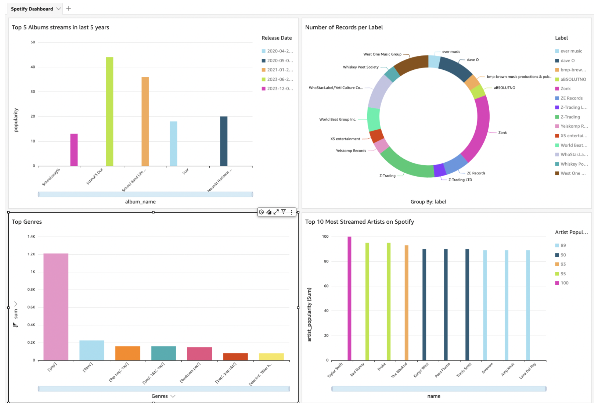

# Real-time Data Streaming and Data Warehousing Pipeline 

---

## CHAPTER 1: INTRODUCTION

In today's data-centric world, where the volume, velocity, and variety of data continue to soar, the efficient management and utilization of data assets have become pivotal. A data pipeline orchestrates the seamless flow of data from disparate sources to actionable insights, driving informed decision-making and operational excellence.

This project focuses on building a robust pipeline using **Spotify data** to integrate real-time data streaming and data warehousing solutions. The pipeline leverages cutting-edge technologies such as **Kafka, AWS EC2, AWS Glue, Amazon Athena, and Amazon QuickSight**. 

---

## CHAPTER 2: DATA DESCRIPTION AND ANALYSIS

- **Files:** Albums, artists, tracks, features, and Spotify data 2023.  
- **Key Columns:**  
  - `track_name`, `track_id`, `artist_name`, `artist_popularity`, `album_name`, `album_popularity`, and more.

**Preprocessing:**  
The dataset was cleaned, anomalies rectified, and missing values addressed to ensure reliability for analysis.

---

## CHAPTER 3: DESIGN OF DATA PIPELINE

### **Pipeline Components**
1. **Data Ingestion:**  
   - Extracted data from CSV files in **Amazon S3** using **AWS Glue crawlers** for schema discovery.
2. **Real-time Streaming:**  
   - Used **Apache Kafka** for streaming data in real-time.  
   - Kafka topics represent streams like artists, tracks, and albums.
3. **Staging Layer:**  
   - **AWS EC2** instances used for transformation and staging with Python scripts.  
   - EC2 instances ensure fault tolerance and scalability.
4. **Data Transformation:**  
   - **AWS Glue ETL jobs** performed data cleansing, normalization, and aggregation.
5. **Data Warehousing:**  
   - Transformed data stored in **Amazon S3** for efficient storage and retrieval.  
   - **AWS Glue Crawler** managed metadata.
6. **Querying:**  
   - **Amazon Athena** enabled interactive querying directly on S3 data using SQL.
7. **Visualization:**  
   - Insights visualized with **Amazon QuickSight** dashboards.

### **Pipeline Diagram**

---

## CHAPTER 4: RESULT ANALYSIS

The pipeline's implementation provided several outcomes:  
1. **Scalability:**  
   - Seamless processing of vast data volumes, ensuring uninterrupted platform operations.  
2. **Real-time Processing:**  
   - Delivered personalized recommendations instantly, enhancing user retention.  
3. **Diverse Data Handling:**  
   - Efficiently processed complex data structures, offering insights into user preferences.  

### **Cluster Analysis**
#### Cluster 1

#### Cluster 2

### **QuickSight Visualizations**
- **Top Albums in the Last 5 Years:** Trends and metrics on album performance.  
- **Top Genres:** Popularity trends over time, guiding content strategies.  
- **Most Streamed Artists:** Insights into artist metrics for promotional campaigns.

---

## CHAPTER 5: CONCLUSION AND FUTURE SCOPE

The pipeline revolutionized Spotify's data handling by:  
- Enhancing scalability and real-time processing capabilities.  
- Managing diverse datasets and providing actionable insights.  
- Delivering personalized recommendations and curated playlists.  

### **Future Scope**
- Integration of machine learning and AI for deeper personalization.  
- Exploration of new trends like podcasts and audiobooks for content diversification.
